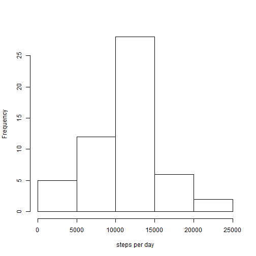

## Reproducible Research Peer Assessment 1

### Reading the data
 

```r
data <- read.csv("activity.csv")
```
 
### Steps taken per day statistics
 
Histogram of total amount of steps per day

```r
stepsPerDay <- aggregate(steps ~ date, data = data, sum)
hist(stepsPerDay$steps, xlab = "steps per day", main = "")
```

 
 
Mean and median of total amount of steps per day

```r
mean(stepsPerDay$steps)
```

```
## [1] 10766.19
```

```r
median(stepsPerDay$steps)
```

```
## [1] 10765
```
 
### Average daily activity pattern
 
Plot of averages of steps per 5-minute interval

```r
averagePerInterval <- aggregate(steps ~ interval, 
                                data = data, mean)
plot(averagePerInterval, type = 'l',
     xlab = "interval", ylab = "average steps")
```

 
 
On which interval the maximum is achieved

```r
averagePerInterval$interval[which.max(averagePerInterval$steps)]
```

```
## [1] 835
```
 
### Imputing missing values
 
The total number of missing values in dataset

```r
sum(is.na(data))
```

```
## [1] 2304
```
 
Let's change missing values in dataset on averages of intervals.
 
Create new data set

```r
indices <- sapply(data$interval[is.na(data$steps)], function(x)which(averagePerInterval$interval == x))
data[is.na(data$steps),1] <- averagePerInterval$steps[indices]
```
 
New amount of days per steps taken

```r
stepsPerDay <- aggregate(steps ~ date, data = data, sum)
hist(stepsPerDay$steps, xlab = "steps per day", main = "")
```

 
 
New mean and median

```r
mean(stepsPerDay$steps)
```

```
## [1] 10766.19
```

```r
median(stepsPerDay$steps)
```

```
## [1] 10766.19
```
 
Mean does not changed, median is not equal to mean, which was not true for first data set.
 
### Differences in activity patterns between weekdays and weekends
 
Binding a new variable, which indicates whether a given date is a weekday or a weekend day

```r
byDayType <- sapply(weekdays(as.Date(data$date)),
                    function(x) {
                    if ( x == "Sunday" || x == "Saturday" )
                      return ("weekend")
                    "weekday"
                  })
data <- cbind(data, dayType = factor(x = byDayType, levels = c("weekday", "weekend")))
```
 
Making a plot of averages of steps taken across all weekday days or weekend days

```r
byDayType <- split(data, data$dayType)
weekdayData <- aggregate(steps~interval,data = byDayType$weekday,mean)
weekendData <- aggregate(steps~interval,data = byDayType$weekend,mean)
par(mfrow = c(2, 1), mar = c(3, 4, 2, 1))
plot(weekdayData, type = 'l', main = "weekday")
plot(weekendData, type = 'l', main = "weekend")
```

 
